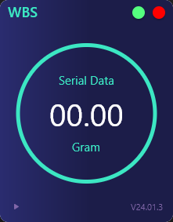
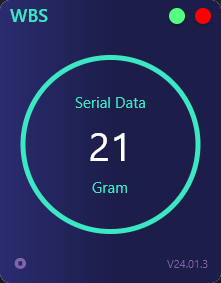

# Weight Scale Desktop App

This is a simple desktop application that reads data from a weighing scale connected to your computer via RS232. The goal is to retrieve weighing data from an Arduino plugged into the PC.

## Getting Started

To customize the configuration for reading data, follow these steps:

1. Open the file `lib\app\modules\home\controllers\serial_controller.dart`.
2. Locate the following code snippet:

```dart
final _baudrate = 115200;
void initializeSerialPort() {
    _port ??= SerialPort("COM5");
    final config = SerialPortConfig();
    config.baudRate = _baudrate;
    config.parity = 0;
    config.bits = 8;
    config.stopBits = 1;
    config.dtr = 1;
    config.rts = 1;
    _port!.config = config;
  }
```

3. Adjust the configuration values according to your needs.

## Dependencies

This project utilizes the [flutter_libserialport](https://pub.dev/packages/flutter_libserialport) package to handle serial communication. Refer to the package documentation for more details.

## Screenshots

 

## Build

If you wish to build this project, use the following command:

```bash
flutter build windows
```

Feel free to explore and modify the code based on your requirements.
